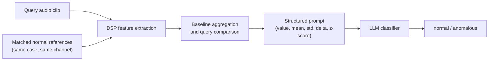

# MobiSys 2026 Poster Copy Draft

Project: Reference-Based Prompting for Acoustic Anomaly Detection

Purpose: This document collects English poster text blocks based on the accepted 2-page paper and the project report. It is intentionally more complete than a final poster. Sections can be cropped, shortened, or rearranged during poster design.

---

## 1. Title Options

### Current Accepted Title

**Reference-Based Prompting for Acoustic Anomaly Detection**

### More Explicit Poster Title

**Reference-Based LLM Prompting for Low-Shot Machine Sound Anomaly Detection**

### More Systems-Oriented Title

**Training-Free LLM Comparison for Low-Shot Acoustic Anomaly Detection**

### Short Display Title

**LLMs for Low-Shot Machine Sound Anomaly Detection**

---

## 2. One-Sentence Pitch

We study whether LLMs can detect machine sound anomalies from compact DSP summaries, and find that prompting is most useful when the model compares a query clip against a small set of matched normal references.

Alternative:

LLM-based acoustic anomaly detection worked poorly as pure zero-shot judgment, but became useful when reformulated as reference-based comparison against matched normal clips.

---

## 3. Short Abstract for Poster Header

We present a training-free reference-based LLM approach for low-shot acoustic anomaly detection. Each machine sound clip is represented by a compact DSP summary, and the LLM compares a query against matched normal references through aggregated baseline statistics and explicit query-to-baseline differences. On ToyADMOS ToyConveyor, LLM prompting is competitive in the 4-shot regime, but a classical one-class SVM becomes stronger when 16 matched normal references are available. These results suggest that LLM prompting is most useful as a low-shot structured comparator, rather than as a universal replacement for normal-only anomaly detectors.

Shorter version:

We explore LLM prompting for machine sound anomaly detection using DSP summaries. Pure zero-shot prompting was unreliable, while matched normal references made the task more tractable. LLM prompting was competitive with one-class SVM in the 4-shot regime, but classical normal-only modeling became stronger at 16-shot.

---

## 4. Motivation

Industrial machines often produce acoustic signatures that change when faults, abnormal loads, or mechanical disturbances occur. Acoustic anomaly detection is therefore useful for condition monitoring and predictive maintenance, especially when cameras or intrusive sensors are impractical.

Most acoustic anomaly detection methods rely on task-specific models trained on normal data. This raises a practical question: can a general-purpose LLM support early-stage anomaly detection when only a few normal examples are available?

Our study asks whether LLMs can act as structured comparators over lightweight acoustic descriptors. Instead of sending raw audio to the model, we summarize each clip using DSP features and ask the LLM to classify the query relative to matched normal references.

Compact version:

Machine sound anomaly detection usually requires task-specific acoustic models. We ask whether LLMs can provide a training-free alternative when only a few matched normal clips are available.

---

## 5. Research Question

Main question:

**Can LLMs perform low-shot acoustic anomaly detection by comparing a query sound against a few matched normal references?**

Sub-questions:

- Is pure zero-shot prompting reliable for machine sound anomaly detection?
- Do matched normal references improve LLM decisions?
- How does LLM prompting compare with a classical one-class baseline?
- When does reference-based prompting help, and when does normal-only fitting become stronger?

---

## 6. Problem Setup

Task:

- Input: a ToyConveyor machine sound clip.
- Output: `normal` or `anomalous`.
- Dataset: ToyADMOS ToyConveyor, IND recordings only.
- References: normal clips from the same machine case and recording channel.
- Main setting: no anomalous examples are used in the prompt.

Why binary only:

ToyConveyor anomaly codes correspond to combinations of abnormal conditions rather than clean single-cause labels. We therefore evaluate binary anomaly detection instead of root-cause classification.

Poster-friendly version:

We treat acoustic anomaly detection as binary classification. Given a query clip and a small set of matched normal references, the model predicts whether the query is normal or anomalous. Matched references come from the same machine case and recording channel.

---

## 7. System Overview

The system is training-free for the LLM. It does not update model parameters. It converts both query and reference clips into scalar DSP features, aggregates reference features into a baseline profile, and sends a structured query-to-baseline summary to the LLM.

Pipeline:

1. Select matched normal references.
2. Extract DSP features from query and references.
3. Aggregate references into per-feature mean and standard deviation.
4. Compute query-to-baseline deltas and z-scores.
5. Format a structured prompt.
6. Ask the LLM to output `normal` or `abnormal`.

Compact version:

The LLM receives a structured summary rather than raw audio: query feature values, baseline mean/std from matched normal clips, and query-to-baseline z-scores.

---

## 8. Diagram Text

Suggested flowchart labels:

```text
Query audio clip
        |
        v
DSP feature extraction
        ^
        |
Matched normal references
(same case, same channel)
        |
        v
Baseline aggregation
and query comparison
        |
        v
Structured prompt
(value, mean, std, delta, z-score)
        |
        v
LLM classifier
        |
        v
normal / anomalous
```

Mermaid version:



Figure caption:

Training-free reference-based prompting pipeline. Query and matched normal clips are converted into scalar DSP features. Reference clips form a per-feature baseline, and the LLM classifies the query from baseline-relative statistics.

---

## 9. Acoustic Representation

Each clip is compressed into 11 scalar DSP features:

| Feature | Description |
|---|---|
| `rms_energy` | RMS energy of the waveform |
| `zero_crossing_rate` | fraction of adjacent samples with sign changes |
| `spectral_centroid` | centroid of the clip-level mean spectrum |
| `spectral_bandwidth` | spectral spread around the centroid |
| `spectral_rolloff` | 85% spectral rolloff frequency |
| `dominant_frequency` | largest non-DC peak in the mean spectrum |
| `harmonic_strength` | dominant peak neighborhood energy divided by total spectral energy |
| `high_frequency_ratio` | ratio of high-frequency spectral energy |
| `burst_count` | count of local short-time RMS peaks above median + 3 MAD |
| `log_mel_mean` | global mean of the log-mel spectrogram |
| `log_mel_std` | global standard deviation of the log-mel spectrogram |

Short prose:

We use lightweight clip-level DSP descriptors covering energy, spectral shape, dominant peak structure, temporal burstiness, and global log-mel statistics. Each feature is a scalar, making the prompt compact and easy to inspect.

---

## 10. Reference Aggregation

For each case/channel group, all queries share a fixed deterministic reference set. References are selected from normal clips using approximately uniform sampling within the matched group.

For each feature, reference clips are aggregated into:

- baseline mean
- baseline standard deviation

The query is then represented by:

- raw feature value
- baseline mean
- baseline standard deviation
- delta from baseline mean
- z-score

Poster wording:

Matched normal clips are compressed into a per-feature baseline profile. The LLM does not see raw reference audio; it sees how the query differs from the reference distribution.

---

## 11. Prompt Example

Use this as a shortened poster snippet:

```text
System:
You are a machine sound anomaly classifier.
Use only the supplied acoustic measurements and baseline statistics.
Return exactly one word: normal or abnormal.

User:
case=case3, mode=IND, channel=4

feature_statistics:
zero_crossing_rate:
  value=0.071, baseline_mean=0.060,
  baseline_std=0.006, z_score=1.83

spectral_bandwidth:
  value=1248.4, baseline_mean=1189.7,
  baseline_std=41.2, z_score=1.42

dominant_frequency:
  value=1188.3, baseline_mean=1093.8,
  baseline_std=52.6, z_score=1.80

burst_count:
  value=4.0, baseline_mean=2.1,
  baseline_std=1.0, z_score=1.90

Output:
abnormal
```

Caption:

Illustrative prompt snippet. The actual prompt uses all retained features for the selected configuration and requires a one-word label.

---

## 12. Methods Compared

LLM prompting:

- GPT-5.4-mini
- Gemini 3.1 Flash-Lite
- Structured DSP prompt
- Training-free at inference time
- Same-case, same-channel normal references
- Feature subsets selected by validation experiments

Classical baseline:

- one-class SVM
- fitted using matched normal references
- represents a normal-only classical detector

Important distinction:

The LLM approach does not fit task-specific model parameters. The one-class SVM does fit a one-class decision boundary from the available normal references.

---

## 13. Main Results Table

Use this table on the poster if space allows:

| Method | Shot | Accuracy | F1 |
|---|---:|---:|---:|
| GPT-5.4-mini | 4 | 0.846 | 0.850 |
| Gemini 3.1 Flash-Lite | 4 | 0.791 | 0.812 |
| one-class SVM | 4 | 0.783 | 0.779 |
| GPT-5.4-mini | 16 | 0.865 | 0.877 |
| Gemini 3.1 Flash-Lite | 16 | 0.881 | 0.888 |
| one-class SVM | 16 | 0.940 | 0.938 |

Expanded version with ROC-AUC:

| Split | Method | Shot | Acc. | ROC-AUC | F1 |
|---|---|---:|---:|---:|---:|
| Test | GPT-5.4-mini | 4 | 0.846 | 0.873 | 0.850 |
| Test | Gemini 3.1 Flash-Lite | 4 | 0.791 | 0.873 | 0.812 |
| Test | one-class SVM | 4 | 0.783 | -- | 0.779 |
| Test | GPT-5.4-mini | 16 | 0.865 | 0.952 | 0.877 |
| Test | Gemini 3.1 Flash-Lite | 16 | 0.881 | 0.952 | 0.888 |
| Test | one-class SVM | 16 | 0.940 | -- | 0.938 |

Table caption:

Held-out test performance. LLM rows use the best validation-tuned feature subset for each shot regime. The one-class SVM is a classical normal-only baseline fitted on the same number of matched normal references.

---

## 14. Key Finding 1: Zero-Shot Was Unreliable

Full version:

Pure zero-shot prompting was unstable. Without matched normal references, the model lacked a local notion of normal operation and often over-called anomalies or collapsed toward unstable behavior. This suggests that machine sound anomaly detection is difficult to frame as absolute judgment from a single clip.

Short version:

**Zero-shot prompting was unreliable.** The model needed matched normal context to make stable anomaly decisions.

Possible callout:

Zero-shot asks: "Is this globally abnormal?"

Reference-based prompting asks: "Does this deviate from this machine's normal behavior?"

---

## 15. Key Finding 2: Low-Shot LLM Prompting Can Be Competitive

Full version:

At 4-shot, GPT-5.4-mini outperformed one-class SVM on the held-out test split. This suggests that structured LLM prompting can be useful when only a very small number of matched normal clips are available and fitting a stable one-class boundary is difficult.

Short version:

**LLM prompting was most useful in the low-shot regime.** At 4-shot, GPT-5.4-mini achieved F1 0.850, compared with 0.779 for one-class SVM.

Possible callout:

LLM prompting helps when the reference set is too small for a stable fitted detector.

---

## 16. Key Finding 3: Classical Modeling Wins at Higher Shot Count

Full version:

The LLM advantage did not persist at 16-shot. With more matched normal references, one-class SVM achieved the strongest held-out test performance. This suggests that once enough normal data are available, fitting a task-specific one-class boundary can be more effective than prompt-level comparison.

Short version:

**At 16-shot, one-class SVM was strongest.** The LLM method is not a universal replacement for classical normal-only detectors.

Possible callout:

The practical value of LLM prompting is concentrated in the low-shot regime.

---

## 17. Key Finding 4: Reference Quality Matters

Full version:

Reference selection was a central design choice. Same-channel normal references performed better than mixed-channel references. Channel mixing broadened and shifted the normal reference distribution, making the baseline less useful for detecting deviations.

Short version:

**Matched references mattered.** Same-case and same-channel references produced more useful baselines than mixed-channel references.

Possible callout:

More references are not automatically better if they come from a different acoustic condition.

---

## 18. Key Finding 5: Aggregated Baselines Beat Raw Reference Listing

Full version:

Presenting multiple normal examples directly to the LLM did not improve performance. Aggregated baseline statistics worked better than raw reference listing, suggesting that LLMs did not reliably infer the normal distribution from multiple examples in this setting.

Short version:

**Information organization mattered.** Aggregated reference statistics were more useful than listing raw reference examples.

Possible callout:

The model worked better with a compact baseline summary than with more raw context.

---

## 19. Key Finding 6: Feature Redundancy Affects Decisions

Full version:

Several DSP features were highly correlated, especially spectral brightness features and energy/log-mel features. These correlated shifts can be interpreted by the LLM as multiple independent pieces of abnormal evidence, increasing false positives on acoustically active but still normal clips.

Short version:

**Feature redundancy shaped model behavior.** Correlated features can lead to repeated abnormal evidence.

Possible callout:

Feature selection must be calibrated jointly with the reference regime.

---

## 20. Discussion Text

The main result is a crossover rather than a simple win. LLM prompting is useful when normal references are scarce, but classical one-class modeling becomes stronger once more normal data are available. This suggests that LLMs should be viewed as flexible low-shot comparators rather than replacements for fitted anomaly detectors.

The study also shows that prompt success depends strongly on how acoustic information is represented. Matched reference selection, baseline aggregation, and feature subset choice all affected the results. In particular, correlated features can inflate the apparent amount of abnormal evidence.

Together, these findings suggest a practical design rule: use LLM prompting when early deployment has only a few matched normal examples, but switch to task-specific normal-only modeling once enough normal data are available.

---

## 21. Limitations

Short poster version:

- Evaluated on ToyADMOS ToyConveyor IND only.
- Uses compact scalar DSP summaries rather than raw audio.
- Requires matched normal references from the same case and channel.
- Feature and prompt tuning were validation-driven.
- Classical one-class SVM outperformed LLM prompting at 16-shot.

Longer version:

This study is preliminary and controlled. The method was evaluated on ToyADMOS ToyConveyor rather than real industrial deployments. The prompt uses scalar DSP summaries, so it cannot represent detailed time-frequency structure. The strongest LLM settings rely on matched references from the same case and channel. Feature subsets were tuned on validation data, and the best LLM configurations did not dominate the one-class SVM at higher shot counts.

---

## 22. Future Work

Poster bullets:

- Evaluate across more machine types and acoustic environments.
- Compare with stronger training-free few-shot ASD methods.
- Use richer frame-level or learned audio representations.
- Study abnormal exemplar prompting beyond a single anomaly code.
- Investigate local/self-hosted LLMs for edge deployment.
- Develop reference selection methods for realistic deployment conditions.

Compact version:

Future work should test broader datasets, stronger few-shot audio baselines, richer acoustic representations, and realistic reference selection under deployment constraints.

---

## 23. Suggested Poster Layout

Left column:

- Motivation
- Research question
- Problem setup
- Pipeline diagram

Middle column:

- Acoustic representation
- Prompt example
- Main results table
- Low-shot crossover finding

Right column:

- Key findings
- Limitations
- Future work
- QR code / paper link / contact

Alternative layout:

- Top: title, one-sentence pitch, pipeline diagram.
- Middle: results table and three key findings.
- Bottom: limitations, future work, acknowledgments.

---

## 24. Ultra-Condensed Poster Text

Use if space becomes very tight:

**Problem.** Can LLMs detect machine sound anomalies when only a few normal examples are available?

**Approach.** Convert each clip into scalar DSP features, aggregate matched normal references into baseline statistics, and ask the LLM to classify the query from baseline-relative values.

**Finding.** LLM prompting is useful in the low-shot regime: GPT-5.4-mini outperformed one-class SVM at 4-shot. At 16-shot, one-class SVM became clearly stronger.

**Takeaway.** LLMs are promising as training-free low-shot acoustic comparators, but not as replacements for classical normal-only detectors when enough normal references are available.

---

## 25. Suggested Main Takeaways

Pick 3 for the final poster:

1. **Reference-based prompting is more reliable than zero-shot judgment.**
2. **LLM prompting is competitive in the 4-shot regime.**
3. **Classical one-class modeling is stronger at 16-shot.**
4. **Matched references matter: same-channel references are better than mixed-channel references.**
5. **Aggregated baseline statistics are more effective than raw reference listing.**
6. **Feature redundancy can inflate false positives.**

Recommended final three:

- Reference-based prompting is more reliable than zero-shot judgment.
- LLM prompting is most useful when matched normal references are very scarce.
- Classical one-class modeling becomes stronger once more normal references are available.

---

## 26. Figure and Table Captions

Pipeline caption:

Training-free reference-based prompting pipeline. Query and matched normal clips are converted into scalar DSP summaries. The reference set defines a per-feature baseline, and the LLM receives query-to-baseline comparison values.

Main results caption:

Held-out test results on ToyADMOS ToyConveyor IND. LLM prompting is competitive at 4-shot, while one-class SVM becomes strongest at 16-shot.

Prompt snippet caption:

Illustrative structured prompt. The model receives baseline-relative DSP statistics and returns a single label.

Feature table caption:

Clip-level scalar DSP features used to summarize each audio clip.

---

## 27. QR / Contact Box Text

Code and extended results:

```text
Scan for paper, code, and extended experiment logs.
```

Contact:

```text
Ruitao Xue
Newcastle University
R.Xue5@newcastle.ac.uk
```

---

## 28. Tone Guidance for Final Poster

Preferred framing:

- Preliminary study
- Low-shot reference-based comparison
- Training-free LLM prompting
- Crossover with classical baseline
- Practical regime where LLM prompting is useful

Avoid overclaiming:

- Do not claim state-of-the-art acoustic anomaly detection.
- Do not claim LLMs replace one-class detectors.
- Do not claim root-cause diagnosis.
- Do not imply zero-shot prompting worked well.

Best public claim:

**LLM prompting can be a useful training-free comparator when only a few matched normal references are available, but classical normal-only modeling remains stronger once more normal data are available.**

